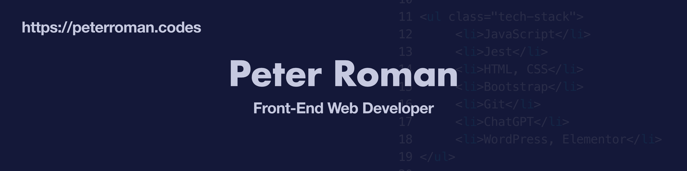

# Peter Roman

## My tech stack
* JavaScript
* Jest
* HTML, CSS
* Bootstrap
* Git
* ChatGPT
* WordPress, Elementor

## Design software I work with
* Figma
* Affinity Designer
* Canva

## Connect with me
* [GitHub](https://github.com/peterRomanDev)
* [LinkedIn](https://www.linkedin.com/in/proman2/)

<!--
**peterRomanDev/peterRomanDev** is a ✨ _special_ ✨ repository because its `README.md` (this file) appears on your GitHub profile.

Here are some ideas to get you started:

- 🔭 I’m currently working on ...
- 🌱 I’m currently learning ...
- 👯 I’m looking to collaborate on ...
- 🤔 I’m looking for help with ...
- 💬 Ask me about ...
- 📫 How to reach me: ...
- 😄 Pronouns: ...
- ⚡ Fun fact: ...
-->
