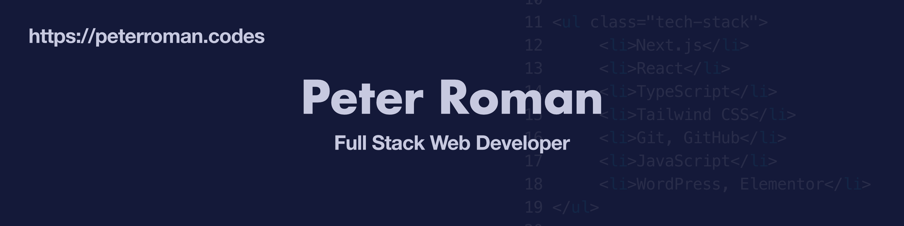

# Welcome To My Profile!

## My Tech Stack
* React
* TypeScript
* JavaScript
* Next.js
* Node.js
* Vercel
* Tailwind CSS
* Bootstrap
* CSS
* HTML
* Git
* GitHub
* Jest
* ESLint
* Prettier
* WordPress, Elementor

## Design Software I Work With
* Figma
* Affinity Designer
* Canva

## Tools for Project Management and Data Analysis I Use
* Google Sheets
* Notion
* Trello
* Monday.com
* Slack

## Connect With Me
* [Portfolio Website](https://peterroman.codes/)
* [GitHub](https://github.com/peterRomanDev)
* [LinkedIn](https://www.linkedin.com/in/proman2/)

<!--
**peterRomanDev/peterRomanDev** is a ✨ _special_ ✨ repository because its `README.md` (this file) appears on your GitHub profile.

Here are some ideas to get you started:

- 🔭 I’m currently working on ...
- 🌱 I’m currently learning ...
- 👯 I’m looking to collaborate on ...
- 🤔 I’m looking for help with ...
- 💬 Ask me about ...
- 📫 How to reach me: ...
- 😄 Pronouns: ...
- ⚡ Fun fact: ...
-->
